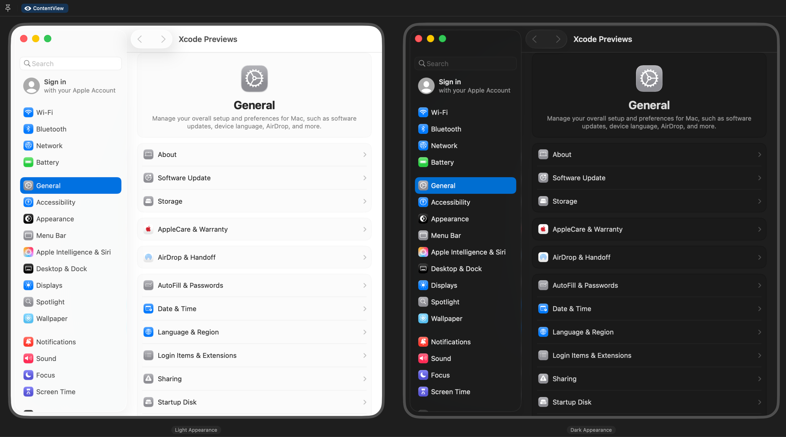
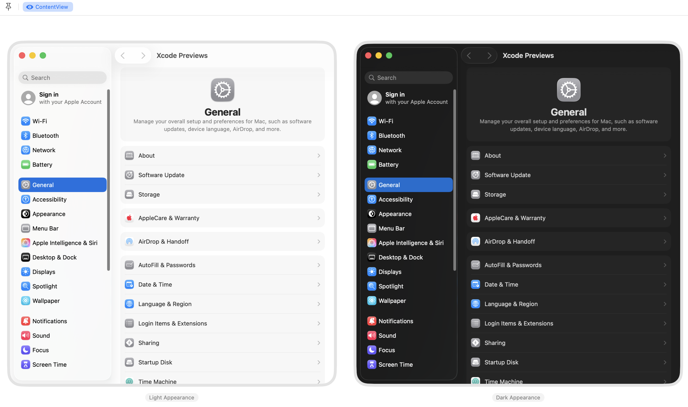

#  System Settings
A **work-in-progress** SwiftUI recreation of the macOS System Settings app.

> [!IMPORTANT]  
> This project is currently focused on macOS 26 beta using Xcode 26 beta. Use an older branch to deploy this project on macOS 15/Xcode 16 or earlier.

macOS 26

  

macOS 15

  

## Information
- This project is a recreation of the System Settings app for macOS 26 **beta 5** (25A5327h).
- All features within the app are only simulations and have no effect on the device.

## Usage
Clone, open, and run the project in Xcode on any Mac on **macOS 26**. Use the 15.5 branch if you are on an older version as new beta APIs are being used in the main branch.

Feel free to download and modify the project for your own personal use.

## Disclaimers
- All assets such as icons and images are not my own in any way.
- This app is a recreation of Apple's own apps and designs for educational purposes only.
- Feel free to look through the commit history to see the project evolve from a single view to its current state.

## Other Settings Projects
- **iOS & iPadOS Settings** https://github.com/zhrispineda/Settings-iOS
- **visionOS Settings** https://github.com/zhrispineda/Settings-visionOS
- **watchOS Settings** https://github.com/zhrispineda/Settings-watchOS
- **tvOS Settings** https://github.com/zhrispineda/Settings-tvOS
