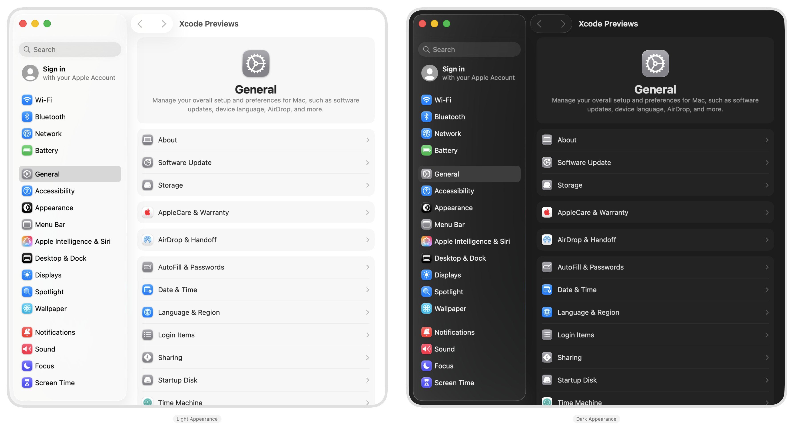

#  System Settings
A **work-in-progress** SwiftUI recreation of the macOS System Settings app.

> [!NOTE]  
> This project is focused on the latest public releases of macOS and Xcode. Use an older branch to use older versions.

## Information
- Based on macOS 26.2 (23C55).
- All features within the app are only simulations and have no effect on the device.
- Previous versions are available as their own branches, going as far back as 15.5. Fewer features are available in earlier versions.

> [!CAUTION]
> Some of the code in this project may rely on private APIs. It is strictly for demonstration purposes only.
>
> **Do not reuse any code from this project that relies on private methods.** Consider publicly supported alternatives instead.

## Preview

<picture>
  <source media="(prefers-color-scheme: dark)" srcset="Assets/PreviewDark.png">
  
</picture>

## Usage
Clone, open, and run the project in Xcode.

## Disclaimers
- This app is a personal and educational recreation of Apple's apps and designs, made in appreciation of the teams that built and maintain them.
- All assets including icons, images, localization strings, and other resources are not my own in any way.
- If you have any questions or feedback, please contact me through the options listed on my profile.

## Other Settings Projects
- **visionOS Settings** https://github.com/zhrispineda/Settings-visionOS
- **iOS & iPadOS Settings** https://github.com/zhrispineda/Settings-iOS
- **watchOS Settings** https://github.com/zhrispineda/Settings-watchOS
- **tvOS Settings** https://github.com/zhrispineda/Settings-tvOS
